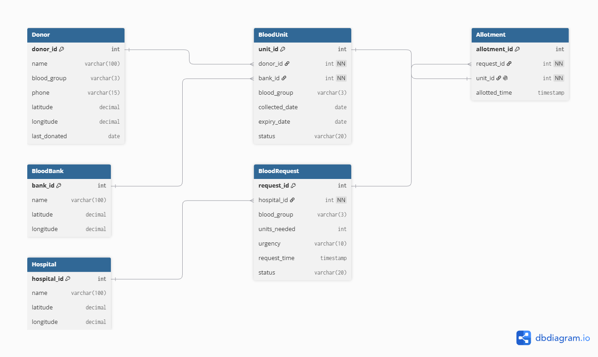
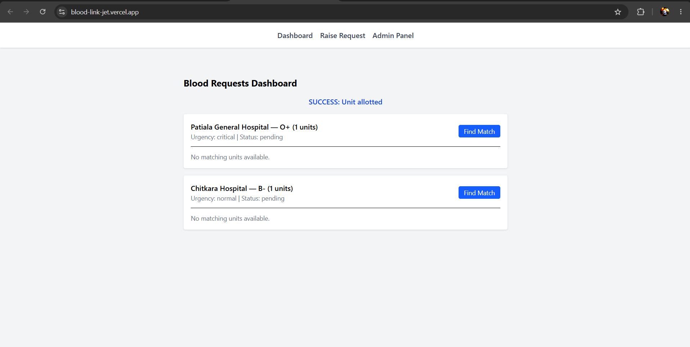
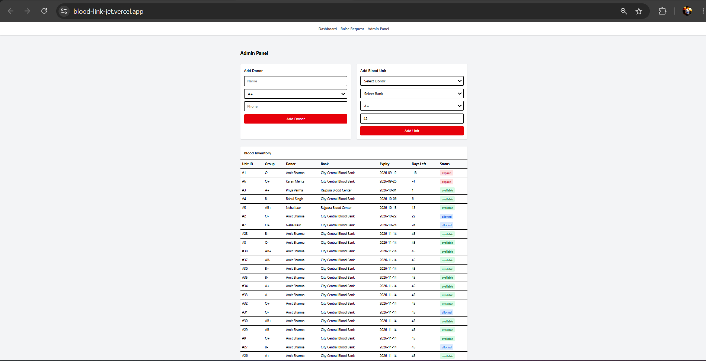

# Blood Bank & Donor-Hospital Matching System

A full-stack DBMS-focused project that matches hospital blood requests to compatible, non-expired blood units in real time — built to demonstrate relational database concepts (stored procedures, triggers/events, transactions, and concurrency control) alongside a full-stack web application.

## Problem Statement

Hospitals often struggle to quickly locate compatible blood units during emergencies, especially across multiple blood banks. Manual tracking also risks blood units expiring unnoticed or being allotted to two requests at once. This system automates compatibility matching, expiry tracking, and safe allotment.

## Key Features

- **Blood group compatibility matching** — automatically finds all donor blood groups compatible with a requested group (e.g., O- can donate to anyone, AB+ can receive from anyone)
- **FIFO allotment** — among compatible units, the one closest to expiry is allotted first, minimizing wastage
- **Auto-expiry** — a scheduled MySQL Event automatically marks blood units as expired once they pass their shelf life, without any application-side logic
- **Transaction-safe allotment** — uses `SELECT ... FOR UPDATE` row-level locking inside a transaction to guarantee a blood unit can never be allotted to two requests simultaneously, with exception handling to prevent crashes on constraint conflicts (verified via concurrent-session testing)
- **Admin Panel** — add donors and blood units, and view a live, color-coded inventory (available / allotted / expired) sorted by expiry date
- **Hospital Dashboard** — raise blood requests, find compatible matches, and allot units in a single flow

## Tech Stack

- **Database:** MySQL (stored procedures, triggers/events, transactions)
- **Backend:** Node.js, Express, mysql2
- **Frontend:** React, Tailwind CSS

## Database Design

6 normalized tables (3NF): `Donor`, `BloodBank`, `BloodUnit`, `Hospital`, `BloodRequest`, `Allotment`.

Key DBMS concepts demonstrated:
| Concept | Where |
|---|---|
| Stored Procedure | `FindMatchingUnits` — compatibility + FIFO logic |
| Stored Procedure + Transaction | `AllotBloodUnit` — row-locking to prevent double-allotment, with exception handling for constraint conflicts |
| Trigger/Event | `expire_old_units` — nightly auto-expiry of blood units |
| Multi-table Joins | Request listing joins `BloodRequest` with `Hospital`; inventory view joins `BloodUnit` with `Donor` and `BloodBank` |
| Referential Integrity | Foreign key constraints across all relationship tables (e.g., prevents deleting a request that already has an allotment) |

## Database Design



6 normalized tables (3NF): `Donor`, `BloodBank`, `BloodUnit`, `Hospital`, `BloodRequest`, `Allotment`.

## Setup Instructions

### 1. Database setup
Run the SQL files **in this exact order**:
```bash
cd database
mysql -u root -p < 01_bloodbank_schema.sql
mysql -u root -p < 02_procedures.sql
mysql -u root -p < 03_triggers_events.sql
mysql -u root -p < 04_seed.sql
mysql -u root -p < 05_allotment_procedure.sql
```

### 2. Backend setup
```bash
cd server
npm install
```
Create a `.env` file in `server/` with:
DB_HOST=localhost
DB_USER=root
DB_PASSWORD=your_mysql_password
DB_NAME=bloodbank_db
PORT=5000

Start the server:
```bash
node index.js
```

### 3. Frontend setup
```bash
cd client
npm install
npm run dev
```

## API Endpoints

| Method | Endpoint | Description |
|---|---|---|
| GET | `/api/blood/match?blood_group=A+&units_needed=2` | Find compatible, non-expired units (FIFO order) |
| POST | `/api/blood/allot` | Allot a specific unit to a request (transaction-safe) |
| POST | `/api/blood/requests` | Create a new blood request |
| GET | `/api/blood/requests` | List all requests |
| GET | `/api/blood/units` | List full blood unit inventory with donor/bank details |
| POST | `/api/blood/units` | Add a new blood unit |
| GET | `/api/blood/donors` | List all donors |
| POST | `/api/blood/donors` | Add a new donor |
| GET | `/api/blood/banks` | List all blood banks |
| GET | `/api/blood/hospitals` | List all hospitals |

## Concurrency Demo

To verify transaction isolation, two separate MySQL sessions were run simultaneously, both attempting `SELECT ... FOR UPDATE` on the same blood unit. The second session correctly blocked until the first session's transaction committed — confirming row-level locking prevents double-allotment even under concurrent access.

## Screenshots




## Author

Prerna — BCA, Chitkara University